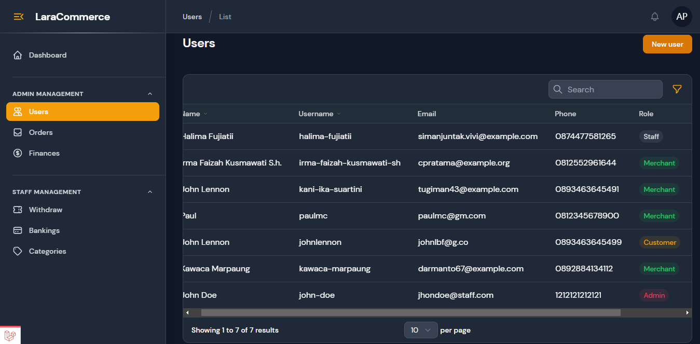
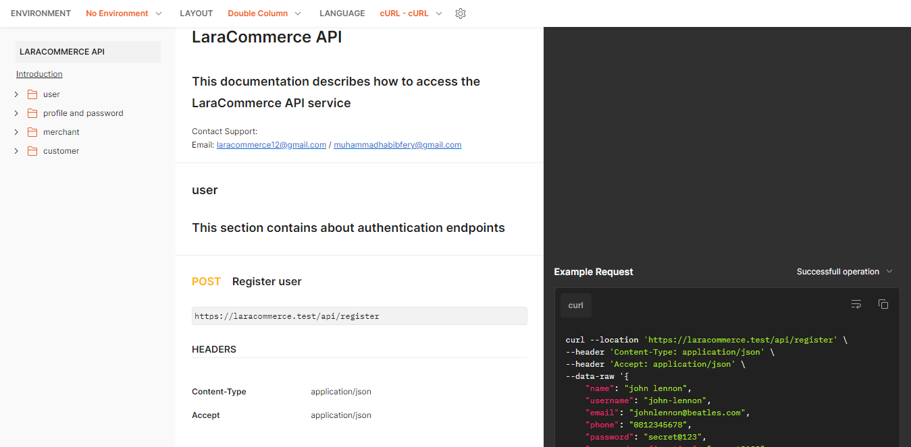

<h1 align="center">
LaraCommerce REST API
</h1>

<h5 align="center">
REST API for E-Commerce platform with admin panel integration.
</h5>

<p align="center">
    <a href="https://github.com/muhammadhabibfery/laracommerce-api/actions/workflows/ci.yml">
    
    <a href="https://www.php.net">
        
    </a>
    <a href="https://laravel.com">
        
    </a>
</p>

</br>

| [Admin Panel Features][] | [Requirements][] | [Install][] | [How to setting][] | [API Docs][] | [License][] |

## Admin Panel Features 
- 

- |<h3>Menu  </h3>        |       Description                                                                 |
  |-----------------------|-----------------------------------------------------------------------------------|
  |<b>Users               | </b>Create employee and manage all users.                                         |
  |<b>Orders              | </b>Manage the orders.                                                            |
  |<b>Finances            | </b>Manage the finances.                                                          |
  |<b>Withdraw            | </b>Manage the merchant's withdraw request.                                       |
  |<b>Bankings            | </b>Create and manage available banking for merchant.                             |
  |<b>Categories          | </b>Create and manage available category for merchant's products.                 |
  |<b>Profile             | </b>Edit user's profile and password.                                             |


## Requirements

	PHP = ^8.1.x
    laravel = ^9.x
    kavist/rajaongkir = ^1.x
    midtrans/midtrans-php = ^2.x
    laravel/scout = ^9.x
    filament/filament = ^2.x
    beyondcode/laravel-websockets = ^1.x
    pusher/pusher-php-server = ^7.x
    flowframe/laravel-trend = ^0.1.x
    barryvdh/laravel-debugbar = ^3.x
    laravel-echo = ^1.15.x
    pusher-js = ^8.x

## Install

Clone repo

```
git clone https://github.com/muhammadhabibfery/laracommerce-api.git
```

Install Composer


[Download Composer](https://getcomposer.org/download/)


composer update/install 

```
composer install
```

Install Nodejs


[Download Node.js](https://nodejs.org/en/download/)


NPM dependencies
```
npm install
```

Run Vite

```
npm run dev
```

## How to setting 

Go into .env file change Database and Email credentials. Then setup some configuration with your own credentials
```
PUSHER_APP_ID=justRandomString
PUSHER_APP_KEY=justRandomString
PUSHER_APP_SECRET=justRandomString
PUSHER_HOST=127.0.0.1
PUSHER_PORT=6001
PUSHER_SCHEME=https|http   (Just choose one)
PUSHER_APP_CLUSTER=mt1

RAJAONGKIR_API_KEY=<Your-API-Key>

MIDTRANS_SERVER_KEY = <Your-Server-Key>
MIDTRANS_PRODUCTION = false
MIDTRANS_SANITIZED = true
MIDTRANS_3DS = true|false   (Just choose one)

<!-- If you are using algolia, change the scout_driver and setting your own algolia credentials -->
SCOUT_DRIVER=database

<!-- If you are using laravel valet and https protocol, add your valet path below -->
LARAVEL_WEBSOCKETS_SSL_LOCAL_CERT='/Users/YOUR-USERNAME/.config/valet/Certificates/VALET-SITE.TLD.crt'
LARAVEL_WEBSOCKETS_SSL_LOCAL_PK='/Users/YOUR-USERNAME/.config/valet/Certificates/VALET-SITE.TLD.key'
LARAVEL_WEBSOCKETS_SSL_PASSPHRASE=''

```

Run the migration

```
php artisan migrate
```

Or run the migration with seeder if you want seeding the related data

```
php artisan migrate --seed
```

Generate a New Application Key

```
php artisan key:generate
```

Create a symbolic link

```
php artisan storage:link
```

## API Docs

</br>
<p style="font-weight: bold;">
Complete REST API Documentation can be found <a href="https://documenter.getpostman.com/view/25234064/2s93JnUSRS">here</a>
</p>


## License

> Copyright (C) 2023 Muhammad Habib Fery.  
**[⬆ back to top](#laracommerce-rest-api)**

[Admin Panel Features]:#admin-panel-features
[Requirements]:#requirements
[Install]:#install
[How to setting]:#how-to-setting
[API Docs]:#api-docs
[License]:#license
